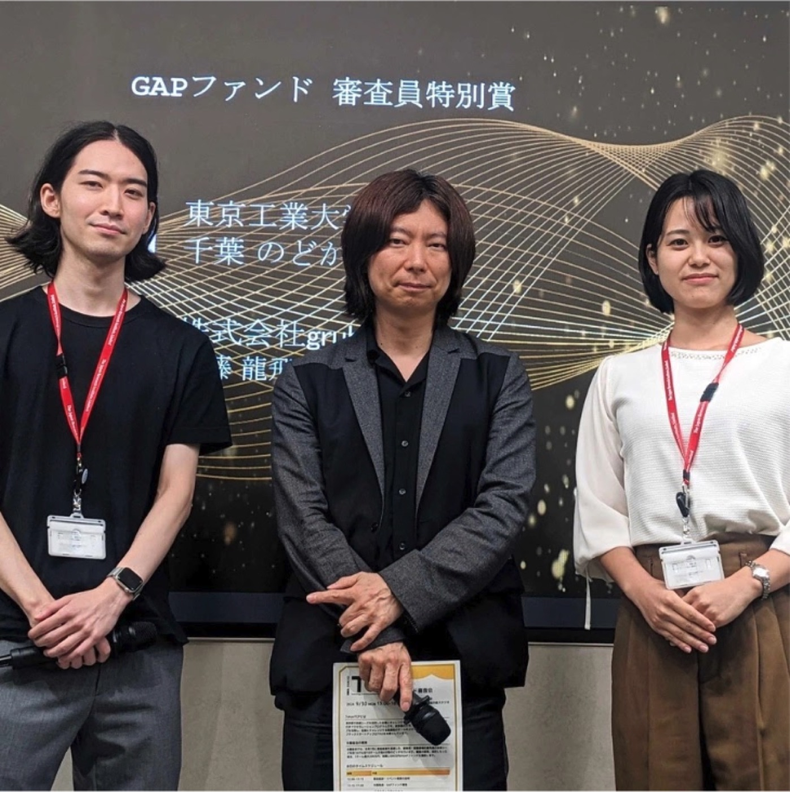

アクセラレーションプログラムでGAPファンド審査員特別賞を受賞

7月より支援を受けているディープテックスタートアップを支援するアクセラレーションプログラムTokyo Technology Commercialization Program（TTCP）の中間報告会が行われ、審査員特別賞を受賞しました。

審査ではビジネスアイデアの実現に向けてPoCイベントの開催の実施など行動を評価していただきました。

ご支援を活かしてディープテック要素の構築等に努めてまいります。

