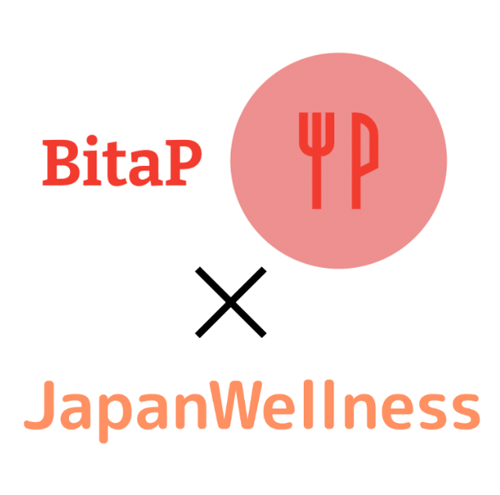

腸活フェアのメニューを監修しました

～腸活フェアのメニュー監修～

社員食堂を運営しているジャパンウェルネス株式会社様（https://freedom-group.co.jp/）が3月に実施された腸活フェアにおいて、BitaPはメニューの監修を行いました。

腸内細菌の働き・効果に関する論文をもとに社員食堂で提供されるメニューの監修を行いました。

このような取り組みにご関心のある方は、以下の連絡先までお気軽にご相談ください。

ジャパンウェルネス株式会社様HPでのご紹介はこちらです。
https://freedom-group.co.jp/%E6%9D%B1%E4%BA%AC%E7%A7%91%E5%AD%A6%E5%A4%A7%E5%AD%A6%E7%99%BA-bitap%E6%A7%98-%E7%9B%A3%E4%BF%AE%E8%85%B8%E6%B4%BB%E3%83%A1%E3%83%8B%E3%83%A5%E3%83%BC%E5%AE%9F%E6%96%BD/

[ 連絡先 ] bitap.health@gmail.com

