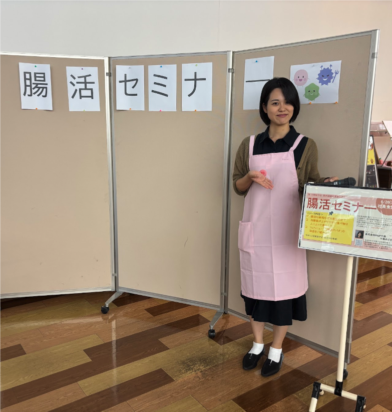
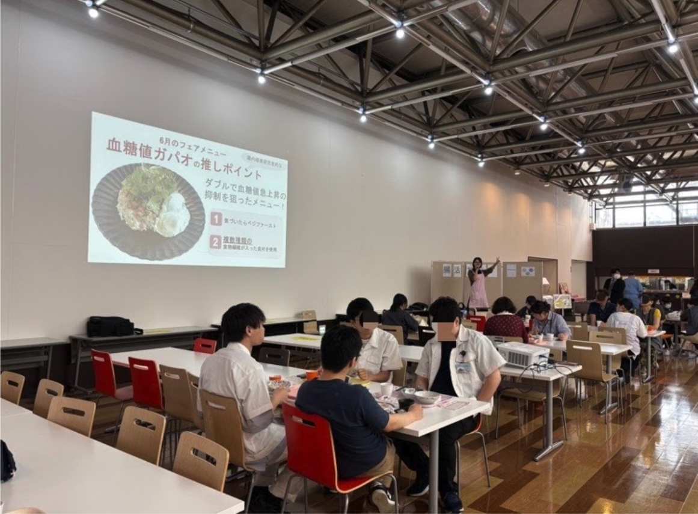
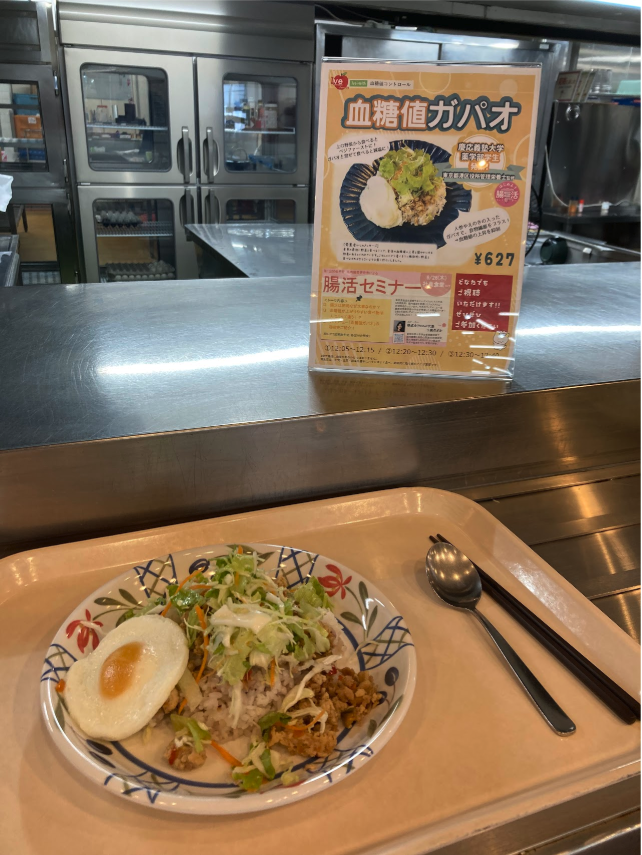
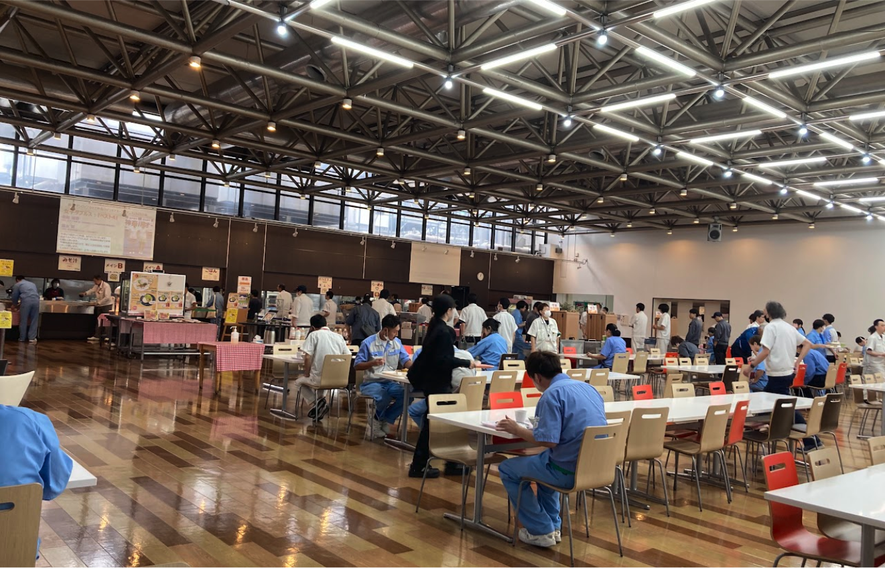

株式会社BitaPは、ジャパンウェルネス株式会社様（東京都豊島区）を通じて、株式会社リコー厚木事業所様の社員食堂にて「ランチタイム腸活セミナー」を実施いたしました。

当日は、慶應義塾大学薬学部の学生が考案した、食後血糖値の急上昇に配慮したメニュー「血糖値ガパオ」が提供され、多くの社員の皆様に好評をいただきました（※詳細はこちらをご覧ください）。

食堂内のステージでは、弊社代表の千葉が登壇し、腸内細菌研究の知見をもとに、食事の選び方のポイントや「社食でできる腸活」についてショートトーク形式でお話しさせていただきました。

今後もBitaPでは、企業の食環境や健康経営をサポートするため、「腸活」をテーマとしたセミナーの企画・実施を行ってまいります。セミナーのご相談やご依頼は、bitap.health[at]gmail.comまでお気軽にお問い合わせください（atを@に変えてください）。テーマや対象者に合わせた内容をご提案いたします。

<!-- 2col -->

<!-- /2col -->

<!-- 2col -->

<!-- /2col -->
