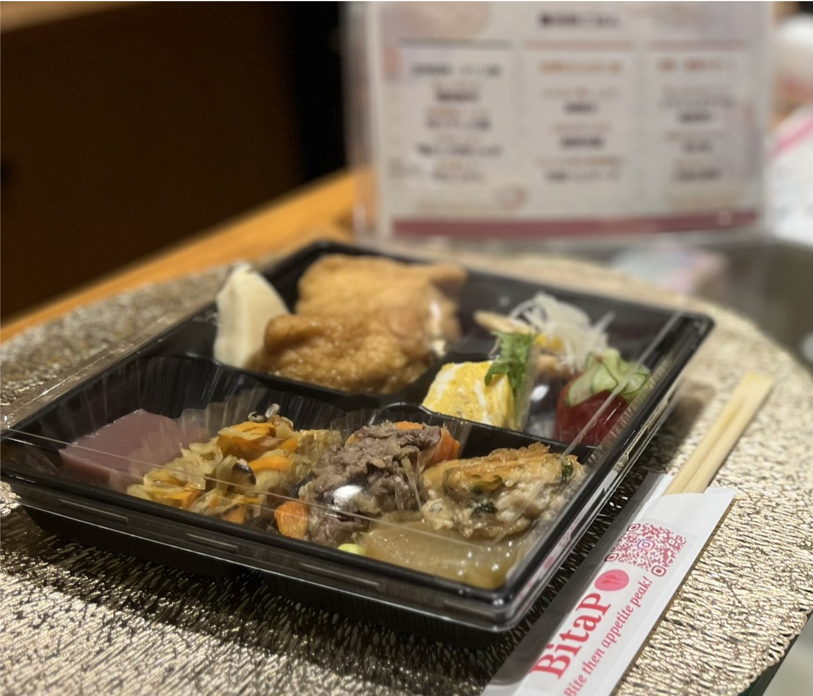
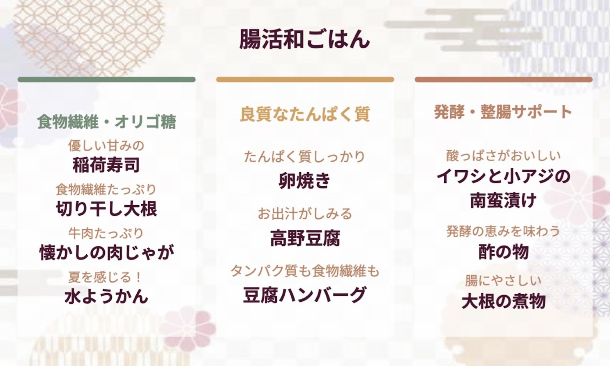

2026年6月30日、株式会社BitaPは、目黒区・池尻大橋にて開催された「academmune Meetup #03」において、懇親会フードの企画・提供を担当いたしました。

本イベントは、研究者と企業がゆるやかにつながり、新たな対話や協業のきっかけを生み出す交流イベントとして開催されました。専門領域や所属を越えて、多様なバックグラウンドを持つ参加者が集い、活発な交流が行われました。

BitaPは、事前ヒアリングにて以下のご要望をいただきました。

⚫︎腸活科学が反映された料理・食事体験であること
⚫︎会話や交流を自然に促す食の場であること
⚫︎イベント後にも続くつながりが生まれること

これらを踏まえ、今回のフードテーマを「腸活和ごはん」としました。

親しみのある和食をベースに、食物繊維、発酵食品、良質なたんぱく質など、腸内環境への配慮につながる要素を取り入れながら、懐かしさと華やかさが共存するメニューを設計しました。日常に馴染みのある料理だからこそ、食材や調理法に工夫を加えることで、新しい食体験へとつなげています。

【今回のケータリングのポイント】

⚫︎腸活科学を自然に取り入れたメニュー設計

単一の健康食材に頼るのではなく、多品目の食材をバランスよく取り入れることで、腸活の考え方そのものを一食の中で表現しました。無理なく、おいしく続けられる食事のあり方を意識しています。

⚫︎交流を妨げない提供設計

今回はお弁当箱形式でご提供しました。講演や会話と並行して食事を楽しみやすく、参加者が自然に交流へ集中できる設計としました。

⚫︎親しみが会話を生む料理構成

稲荷寿司、肉じゃが、卵焼きなど、誰もが親しみを持つ料理を取り入れることで、食事そのものが会話のきっかけとなる構成を目指しました。

【当日のフードテーマ】

「腸活和ごはん」

【当日のフードメニュー】

⚫︎優しい甘みの稲荷寿司

天然穴子と根菜を使用し、油揚げを丁寧に出汁で炊き上げました。

⚫︎食物繊維たっぷり切り干し大根

宮崎県産の切り干し大根に、椎茸・にんじん・真竹を合わせました。

⚫︎牛肉たっぷり懐かしの肉じゃが

甘みの強いキタアカリを使用し、やさしい味わいに仕上げました。

⚫︎夏を感じる水ようかん

小豆と甘酒を使い、ほのかに麹が香る上品な甘さに仕上げました。

⚫︎たんぱく質しっかり卵焼き

たっぷりの出汁を含ませた、やさしい味わいです。

⚫︎お出汁がしみる高野豆腐

噛むたびに出汁の旨みが広がる一品です。

⚫︎タンパク質も食物繊維も豆腐ハンバーグ

鶏肉、豆腐、大葉、胡麻を使用し、隠し味に味噌を加えました。

⚫︎酸っぱさがおいしいイワシと小アジの南蛮漬け

一晩じっくり漬け込み、まろやかな酸味に仕上げました。

⚫︎発酵の恵みを味わう酢の物

トマトときゅうりを、やさしい酸味でさっぱりと仕上げました。

⚫︎腸にやさしい大根の煮物

ごま油の香りとコクを加え、じっくり味を含ませました。

【料理作成】

Aun Kitchen（https://aun-kitchen.com/）

今回もAun Kitchen様にご協力いただき、素材選びから調理まで丁寧に仕上げていただきました。

BitaPでは、料理を提供するだけでなく、イベントの目的や参加者同士のコミュニケーションまで含めた食体験の設計を大切にしています。今後も、食を通じて人と人とのつながりを生み出す場づくりに取り組んでまいります！

＜BitaP口福ケータリングお問い合わせフォームはこちらから＞
https://forms.gle/QPHj2dkgMYtEogHS8

<!-- 2col -->

<!-- /2col -->
