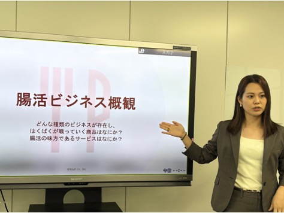
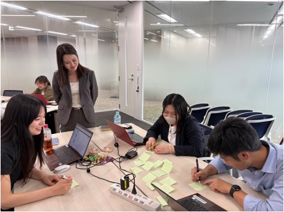

2026年6月29日、7月22日の2日間にわたり、株式会社はくばく様の社員の皆様を対象に、「腸活」をテーマとしたワークショップを実施しました。

講義で腸活に関する基礎知識やビジネス事例を学ぶだけでなく、参加者同士のグループワークを取り入れ、自ら考え、意見を交わしながら理解を深めていただくプログラムとして設計しました。

【ご依頼者さまのニーズ】

ご依頼者：株式会社はくばく　取締役　輿石修さま

⚫︎会社として腸活市場への参入を目指している

⚫︎社内での知見のさらなる共有と、生活者・科学者の両視点からの理解促進を図るため

⚫︎そのため、
　・腸活に関する専門的な知識だけではなく、腸活の魅力を社員にまずは理解してほしかった
　・消費者目線と科学者目線の両方を身につけられる機会を探していた

【実施概要】

実施日　2026年6月29日・2026年7月22日（全2回）
場所　株式会社はくばく様　東京本社
参加人数　10名
形式　代表千葉による腸内細菌および腸活の基礎知識や関連ビジネスに関連する講義、参加者同士のグループワーク
実施時間　各回3時間

【ワークショップの内容】

⚫︎講義

腸活の基礎知識をはじめ、腸内環境を整えることが注目されている背景や、日常生活に腸活を取り入れる意義について解説しました。

また、健康分野にとどまらず、食品やサービスなどに広がる「腸活ビジネス」の事例も紹介。腸活を生活者と事業の両方の視点から捉えられる内容としました。

⚫︎グループワーク

参加者の皆様には、普段の営業活動やそれぞれの業務を通じて培われた知識・経験に、講義で紹介した視点も取り入れながら、3〜4名のグループに分かれて意見を交わしていただきました。各回2つのテーマについて、自社の商品やお客様との接点を踏まえた具体的な意見が数多く挙がり、活発な議論となりました。

⚫︎解説

グループワーク終了後には、各グループから発表された意見やアイデアについて、腸活に関する情報を補足しながら、一緒に考えを整理しました。

参加者の皆様からは、日頃の営業活動や業務経験を踏まえたさまざまな意見が挙がり、BitaPにとっても多くの学びや気づきをいただく時間となりました。

【参加者様からの声】

> とても内容が濃く・深く、専門性もありつつわかりやすいセミナーですごく勉強になりました！

> DAY1もDAY2も1日かけてじっくり考えてみたいと思うくらいに、内容が濃く大変勉強になりました。

> 腸活とはと聞かれた際に、腸活のメリットや、もち麦でなぜ腸活ができるのかの仕組みを伝えることができそうです。

> 商談時に今までより科学的根拠を持って提案できると思いました。

参加者の皆様からは、内容の専門性と分かりやすさに加え、腸活のメリットや、もち麦を通じて腸活につながる仕組みへの理解が深まったとの声をいただきました。また、今回学んだ内容を、お客様への説明や商談時の提案に生かしていきたいという感想も寄せられました。

BitaPでは、体質や体調が理由で食に制約を抱える人に、腸活をはじめとする研究知見を使って、心も体も「おいしい」で満たされる食環境を提供することを目指しています。「健康なだけではなく、心身を満たす口福な食」にご関心のある方はご連絡ください。

＜お問い合わせフォーム＞
BitaP連絡先：info@bitap.co.jp

<!-- 2col -->

<!-- /2col -->
