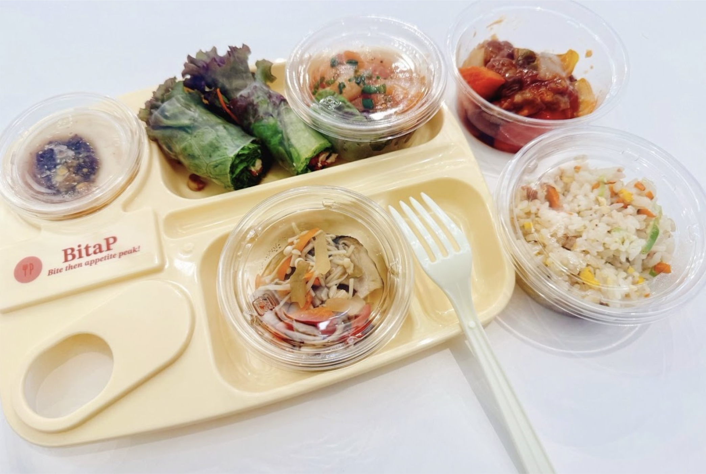
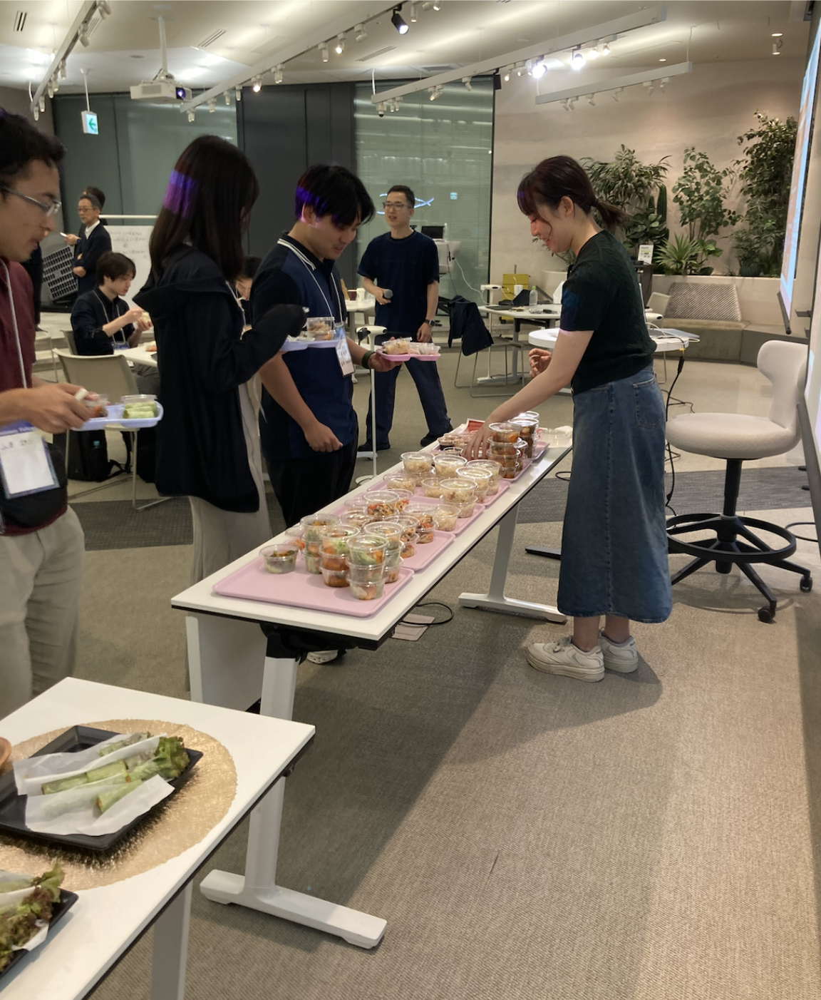
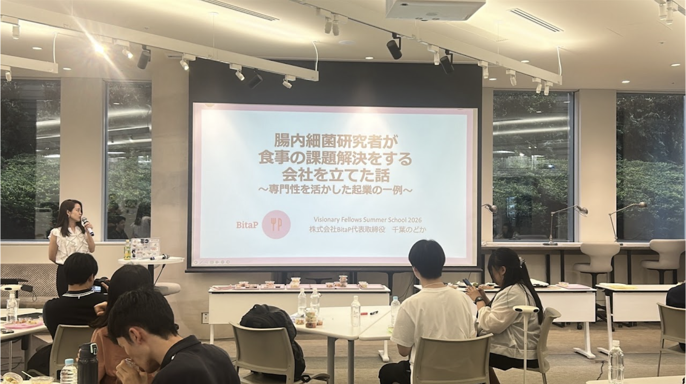
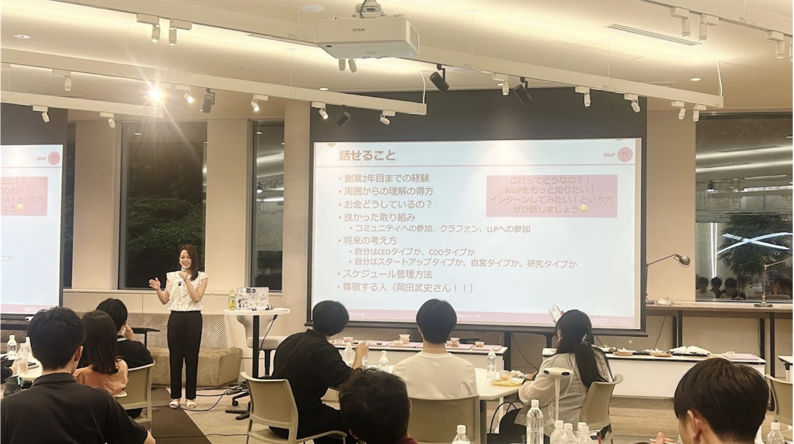

2026年7月25日、株式会社BitaPは、日本橋三井タワーで行われた、株式会社Beyond Next Ventures様が主催する「Visonary Fellows, Summer School 2026」において、懇親会のフード提供の企画を担当いたしました。

当日は、全国から博士課程の学生や博士課程に進学予定の修士の学生が集まり、分野を超えた交流やリーダーシップについて学ぶプログラムが行われていました。

BitaPは、「中華料理 × 18種類の植物性食材」をテーマに、腸内環境への配慮を取り入れたメニュー企画・ケータリング手配・ポップ制作・当日運営サポートを担当しました。また、研究を活かした起業や博士課程修了後のキャリアについて、BitaPの取り組みを交えながら参加者へプレゼンテーションを行い、研究者の多様なキャリアの可能性について考える機会を提供しました。

【当日のフードテーマ】

「中華料理 × 18種類の植物性食材」

1週間に30種類以上の植物性食材を食べる人は、腸内細菌の多様性が高い傾向にあることが報告されています。（D McDonald et al., mSystems, 2018）

本日のメニューでは18種類の植物性食材を使用しました。野菜やきのこ、豆類、ごまなどをバランスよく取り入れ、中華料理ならではの彩りや食感、風味を楽しめる献立に仕上げています。

【当日のフードメニュー】

⚫︎食感がたのしい五目チャーハン

もち麦や人参など、さまざまな食材を加え、食感豊かに仕上げた五目チャーハンです。

もち麦には水溶性食物繊維の一種であるβ-グルカンが含まれており、具材それぞれの食感や彩りを楽しめる一品に仕上げました

⚫︎黒酢酢豚と選べる２種類のタレ

〜甜麺醤の発酵コク甘だれと生姜香るすっきり黒酢だれ〜

レンコン、パプリカ、ピーマン、人参など彩り豊かな野菜をたっぷり使用し、食べ応えのある酢豚に仕上げました。

コクのある甜麺醤だれと、生姜が香るさっぱり黒酢だれの2種類をご用意。お好みに合わせて選べる楽しさも、このメニューの魅力です。

⚫︎ぷりぷりエビチリ

ぷりっとしたエビに、玉ねぎやにんにくなどの香味野菜を合わせ、ほどよい辛さのチリソースで仕上げました。

にんにくや玉ねぎには、善玉菌のエサとなるイヌリンやフルクトオリゴ糖が含まれており、腸内細菌をサポートする食材としても知られています。

⚫︎3種のきのこのマリネ

3種類のきのこを、それぞれの食感を活かしてマリネに仕上げました。きのこにはβ-グルカンなどの食物繊維が含まれており、腸活にもおすすめの食材です。

⚫︎中華風生春巻き

サニーレタス、蒸し鶏、きゅうり、人参をたっぷり包み、中華風の香味だれでさっぱりと仕上げました。

シャキシャキとした野菜ともちもちの皮が楽しめる、夏にぴったりの一品。彩り豊かな野菜で、季節の味わいを感じていただけます。

⚫︎実は腸活な豆乳パンナコッタ

豆乳を使ってなめらかに仕上げたパンナコッタに、白すりごま、きなこ、つぶあんを合わせました。

豆乳やきなこ、ごまなど植物性の食材を組み合わせた、やさしい甘さのデザートです。食後までおいしく植物性食材を取り入れられる"実は腸活"な一品です。

【料理作成】

Aun Kitchen（https://aun-kitchen.com/）

【お客様からのひとこと】

Beyond Next Ventures株式会社　津田将志様

> 冷えても美味しかった

Beyond Next Ventures株式会社　森川大地様

> 千葉さんの講演・お料理があったことで、研究の事業化をより身近に感じてくれた学生も多くいたようで、運営目線でも千葉さんにご依頼してとても良かったです。改めてありがとうございました。

食事は、栄養を摂るだけではなく、人と人の交流を生み、心を豊かにするものでもあります。

BitaPはこれからも、腸内環境への配慮だけでなく、彩りや楽しさ、おいしさを大切にした「健康なだけではない、口福な食事」を通じて、豊かな食体験を届けてまいります。

BitaPのケータリングにご関心のある方は以下よりぜひご連絡ください。

お問い合わせフォーム → https://forms.gle/QPHj2dkgMYtEogHS8

<!-- 2col -->

<!-- /2col -->

<!-- 2col -->

<!-- /2col -->
