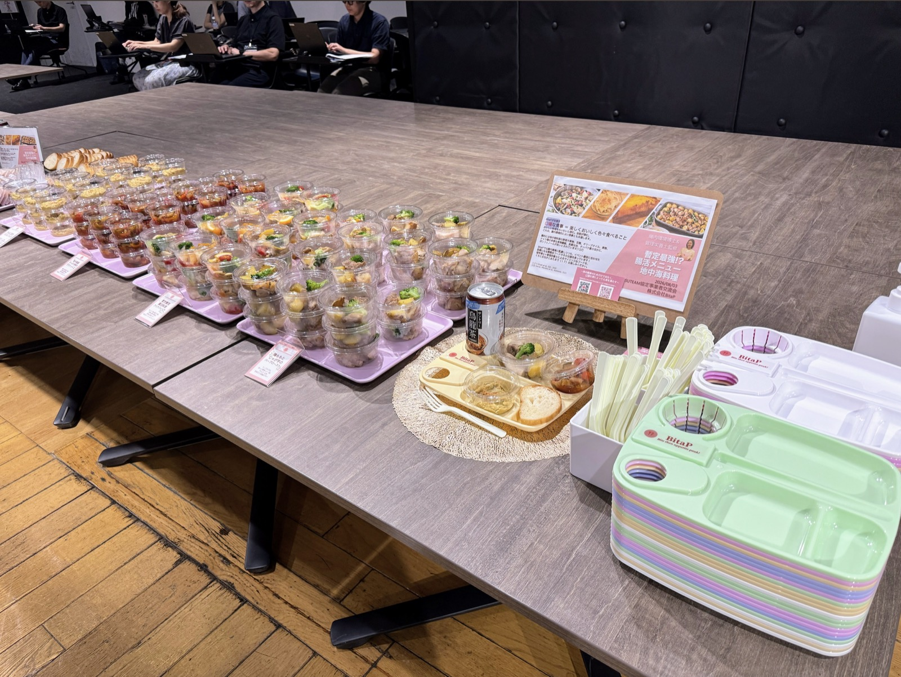
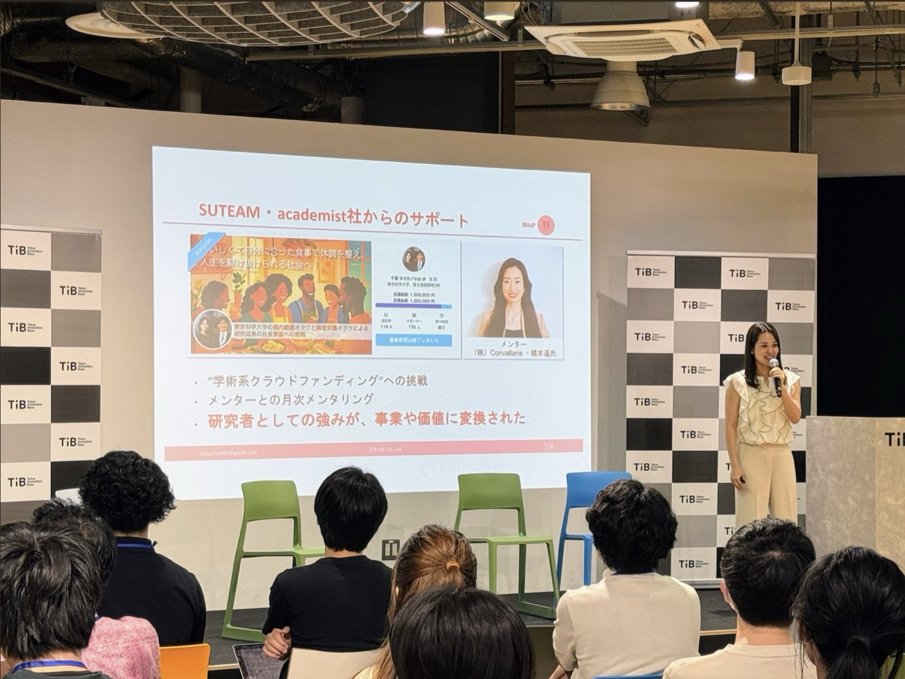
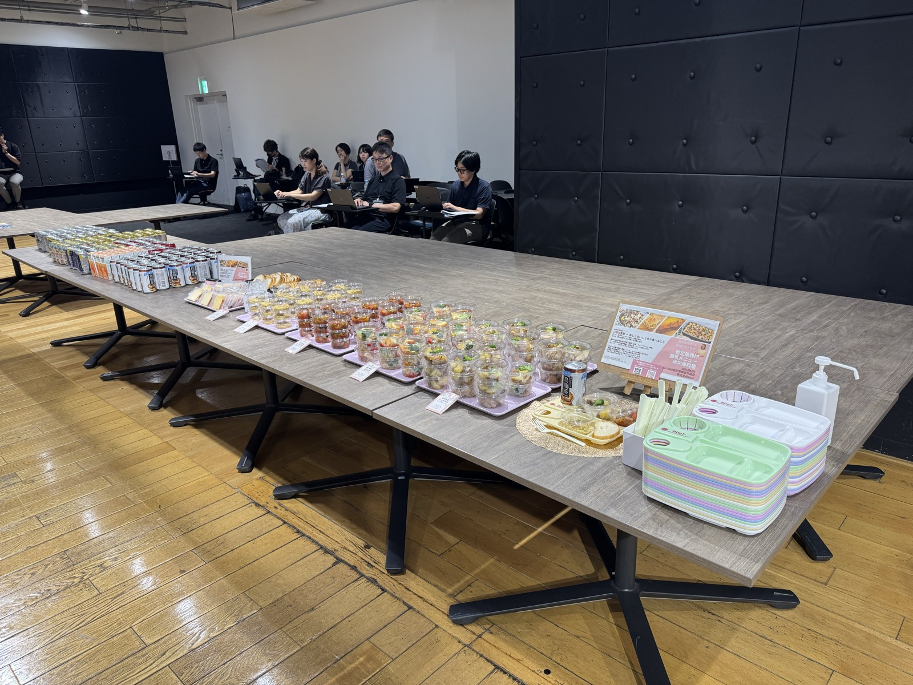
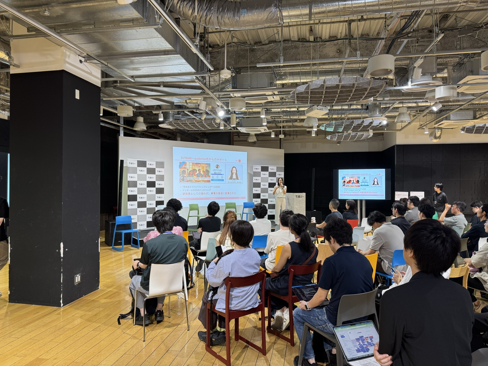

2026年8月3日、株式会社BitaPは、東京都のスタートアップ支援プログラム「Tokyo SUTEAM」の協定事業者交流会において、懇親会のフード提供の企画を担当いたしました。会場はTokyo Innovation Base（TiB／有楽町）です。

当日は、スタートアップ支援に取り組む協定事業者約40社が集まり、支援の実践や連携の可能性について交流が行われました。

BitaPは、腸内細菌研究で注目される地中海料理をテーマに、メニュー企画・ケータリング手配・ポップ制作・当日運営サポートを一貫して行いました。また、代表の千葉が登壇し、学術系クラウドファンディングへの挑戦やメンターとの月次メンタリングを通じて、研究者としての強みが事業や価値へと変換されていった過程をご報告しました。

【当日のフードテーマ】

「暫定最強!? 腸活メニュー：地中海料理」

地中海料理には多様な野菜や果物、豆類、オリーブオイル、ナッツ類が使われており、食物繊維、良質な油、タンパク質に加えてポリフェノールを摂れる点が、腸内環境にとって良いとされています。（T S Ghosh et al., Gut, 2020／C Garcia–Montero et al., Nutrients, 2021）

BitaPが目指す口福な食事とは、楽しくおいしく色々食べること。おいしい料理をわいわいと囲む。会話が弾む。これは、腸内環境的によい食事とも共通します。

【当日のフードメニュー】

⚫︎鶏ももとじゃが芋のハーブロースト

鶏肉をフレッシュのローズマリーやタイムなどのハーブに一晩漬け込み、オーブンでじっくり焼き上げました。付け合わせのじゃが芋も、鶏肉とは時間を変えてゆっくりとオーブンでローストしました。

⚫︎暫定最強腸活料理アクアパッツア

魚介の旨みをたっぷり引き出し、さまざまな野菜と一緒にやさしく煮込みました。野菜は群馬県の産直野菜を使用しました。合計9種類の魚介や野菜が摂れる逸品です。

⚫︎地中海風たっぷり野菜のラタトゥイユ

複数の夏野菜を一度に摂れる一品です。野菜の種類が増えるほど、腸内細菌が利用できる食物繊維の種類も増えます。

⚫︎ひよこ豆のバジルフムス＋小麦からこだわったバゲット

豆の食感を少し残しながら、練りごまとフレッシュレモンで食べやすく仕上げました。バゲットは店主が粉からこだわり、添加物を使わずに焼き上げています。

⚫︎まるっとレモンのパウンドケーキ

柑橘類の皮には食物繊維（ペクチン）が豊富です。ペクチンはお腹で細菌のエネルギー源になります。

【料理作成】

Aun Kitchen（https://aun-kitchen.com/）

食事は、栄養を摂るだけではなく、人と人の交流を生み、心を豊かにするものでもあります。

BitaPはこれからも、腸内環境への配慮だけでなく、彩りや楽しさ、おいしさを大切にした「健康なだけではない、口福な食事」を通じて、豊かな食体験を届けてまいります。

BitaPのケータリングにご関心のある方は以下よりぜひご連絡ください。

お問い合わせフォーム → https://forms.gle/QPHj2dkgMYtEogHS8

<!-- 2col -->

<!-- /2col -->

<!-- 2col -->

<!-- /2col -->
