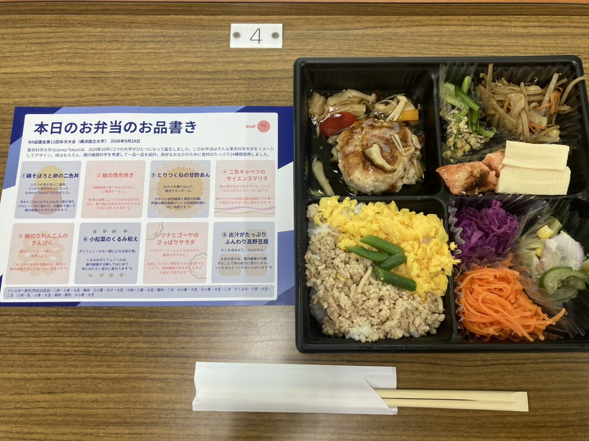
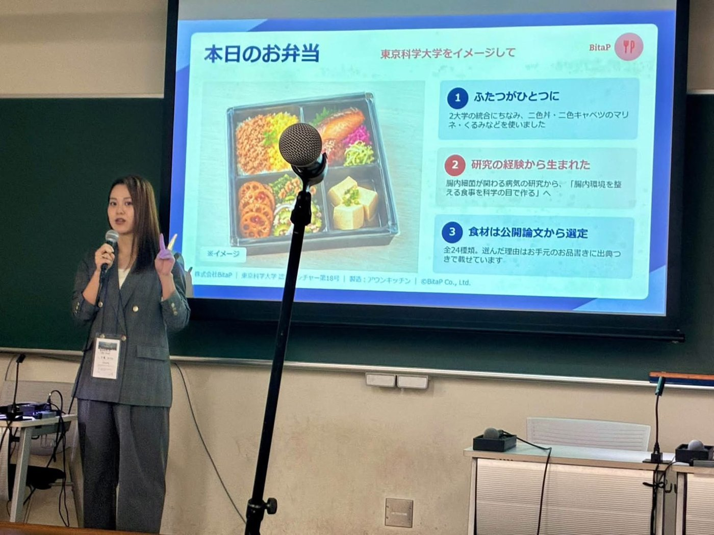

2026年9月29日、株式会社BitaPは、RA協議会第12回年次大会において、東京科学大学アントレプレナーシップ教育機構が主催したランチョンセミナー「起業家育成を超えて：Science Tokyoアントレプレナーシップ教育機構の活動紹介」において、お弁当の提供と講演を行いました。会場は横浜国立大学です。

当日は、大学・研究機関のURA（リサーチ・アドミニストレーター）をはじめとする69名が参加しました。

BitaPは、「東京科学大学をイメージして」をテーマに、お弁当のメニュー設計と手配、ハンドアウト（お品書き）の制作、当日の搬入と配布補助、料理の説明を一貫して行いました。お弁当は69名様分をご用意しました。また、代表の千葉が「起業への挑戦と学び ― 東京科学大学で培ったアントレプレナーシップの一例 ―」と題して登壇し、起業までの道のりと、起業を直接・間接的に後押しした要因、大学から得たもの（授業・プログラム、人、制度・環境）、つまずきから学んだこと、振り返ってあればよかったことをご報告しました。

【ご発注の背景】

東京科学大学アントレプレナーシップ教育機構 人材エコシステム連携室　特任教授　原田隆様

本セミナーは「起業家育成を超えて」と題し、大学におけるアントレプレナーシップ教育の意義を、政策・実践・教育設計の三つの視点から議論するものでした。

そこで、本学の研究成果が社会に還元されている姿を、参加者の皆様に言葉だけでなく体感していただきたいと考え、本学認定ベンチャーである貴社にお弁当の監修をお願いいたしました。

参加者の多くは、各大学・研究機関で研究成果の社会実装に携わるリサーチ・アドミニストレーターです。腸内細菌の研究から生まれた事業が、実際に目の前の食事として形になっている。その事実が、どのような講演よりも雄弁に、本セミナーの主題を伝えてくれるものと考えました。

【当日のフードテーマ】

「東京科学大学をイメージして」

東京科学大学（Science Tokyo）は、2024年10月に2つの大学がひとつになって誕生しました。このお弁当はそんな東京科学大学をイメージしてデザイン。味はもちろん、腸内細菌科学を考慮して一品一品を設計。良好なおなかのために食材はたっぷり24種類使用しました。

【当日のフードメニュー】

⚫︎鶏そぼろと卵の二色丼

ふたつの色が並ぶ二色丼。2つの大学がひとつになった東京科学大学（Science Tokyo）にちなみました。冷めたごはんはでんぷんの一部が消化されにくい形に変わり、大腸まで届いて腸内細菌のエサになります（S Sonia et al., Asia Pac J Clin Nutr, 2015）

⚫︎鮭の西京焼き

発酵味噌の香りをまとわせた、ご褒美サーモン。味噌は発酵によって生まれる成分を含み、鮭の脂は炎症をおだやかにする方向にはたらきます（P C Calder, Biochem Soc Trans, 2017）

⚫︎とりつくねの甘酢あん

おからを練り込んだ、腸活チキンボール。おからの食物繊維と黒酢の酢酸。酢酸は腸内細菌がつくる短鎖脂肪酸と同じ仲間です（P Portincasa et al., Int J Mol Sci, 2022）

⚫︎二色キャベツのサイエンスマリネ

紫と橙が混ざりあうマリネ。これも「ふたつがひとつに」の一品です。紫キャベツの色素は腸内細菌の手を借りて吸収されやすい形に変わります（L Tian et al., Crit Rev Food Sci Nutr, 2019）

⚫︎輪切りれんこんのきんぴら

輪切りレンコンを散らして、見通しよく。ごぼうの水溶性食物繊維は、特定の腸内細菌が好んで食べる代表格です（G R Gibson et al., Gastroenterology, 1995）

⚫︎小松菜のくるみ和え

ポリフェノールも一緒にとれる和え物。くるみのポリフェノールは、腸内細菌が分解してはじめて体にはたらく成分に変わります（M V Selma et al., Clin Nutr, 2018）

⚫︎ツナとゴーヤのさっぱりサラダ

ツナとアーリーレッドを合わせて、後味かろやかに。加熱していない野菜をそのまま食べることで、細胞壁の形を残したまま大腸まで届きます（M M Grundy et al., Br J Nutr, 2016）

⚫︎出汁がたっぷりふんわり高野豆腐

だしを含ませて、ふんわりと。大豆の成分は、腸内細菌が代謝することで別の成分に変わります。つくれる人とつくれない人がいます（K D Setchell & C Clerici, J Nutr, 2010）

【お客様からのひとこと】

東京科学大学アントレプレナーシップ教育機構 人材エコシステム連携室　特任教授　原田隆様

彩り、味ともに大変満足のいくものでした。お願いして正解だったというのが率直なところです。

二色丼や二色キャベツのマリネで「ふたつがひとつに」という大学統合のテーマを表現いただいた点は、参加者の目を引いておりました。お品書きに出典を添えていただいたことで、一品ごとの設計意図が伝わり、食べながら理解が進む構成になっていたことも、本学の意図を的確に汲んでいただいた結果と受け止めております。

参加者に研究成果の社会実装を通じて人々を幸せにしていくという本学の姿勢を体感いただけたと考えております。

【料理作成】

Aun Kitchen（https://aun-kitchen.com/）

食事は、栄養を摂るだけではなく、人と人の交流を生み、心を豊かにするものでもあります。

BitaPはこれからも、腸内環境への配慮だけでなく、彩りや楽しさ、おいしさを大切にした「健康なだけではない、口福な食事」を通じて、豊かな食体験を届けてまいります。

BitaPのケータリングにご関心のある方は以下よりぜひご連絡ください。

お問い合わせフォーム → https://forms.gle/QPHj2dkgMYtEogHS8

<!-- 2col -->

<!-- /2col -->
